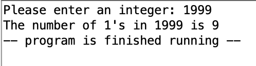
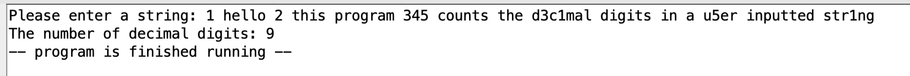

# Computer System Design
Coursework from CMSI 371: Graphics completed at LMU

## Binary Counter
 MIPS assembly language program to count the number of 1s in a 32-bit number. The program is to prompts the user for the input and, once calculated, reports the result. Uses informative text strings for the input and output.

Coded using MIPS assembly language on Mars.

## Decimal Counter
 MIPS assembly language program to count the number of decimal digits in an ascii string of characters. The program is to prompts the user for the input string, counts the number of digits present in the string, and reports the result. Assumes the ascii string contains less than 100 characters. Uses  informative text strings to prompt the user for input and to report the result.

Coded using MIPS assembly language on Mars.

## Jeopardy Theme Song
MIPS assembly language program to play the Jeopardy theme song - can be played with various instruments at different volumes. Uses the sleep and MIDI out assembly directives. 

Coded using MIPS assembly language on Mars.